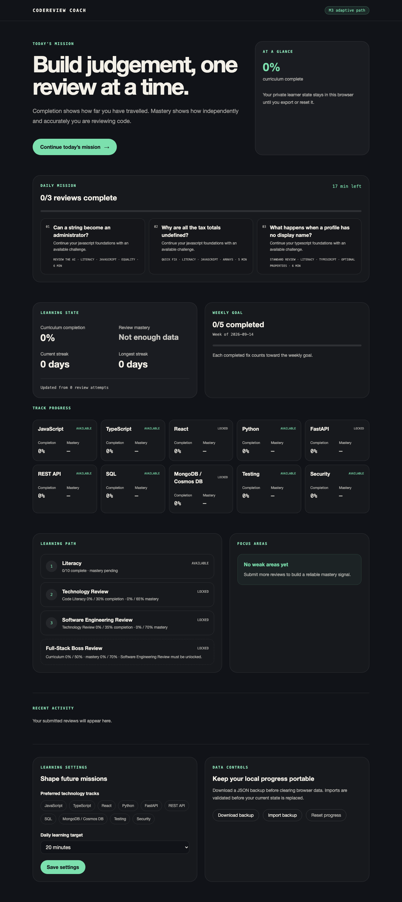
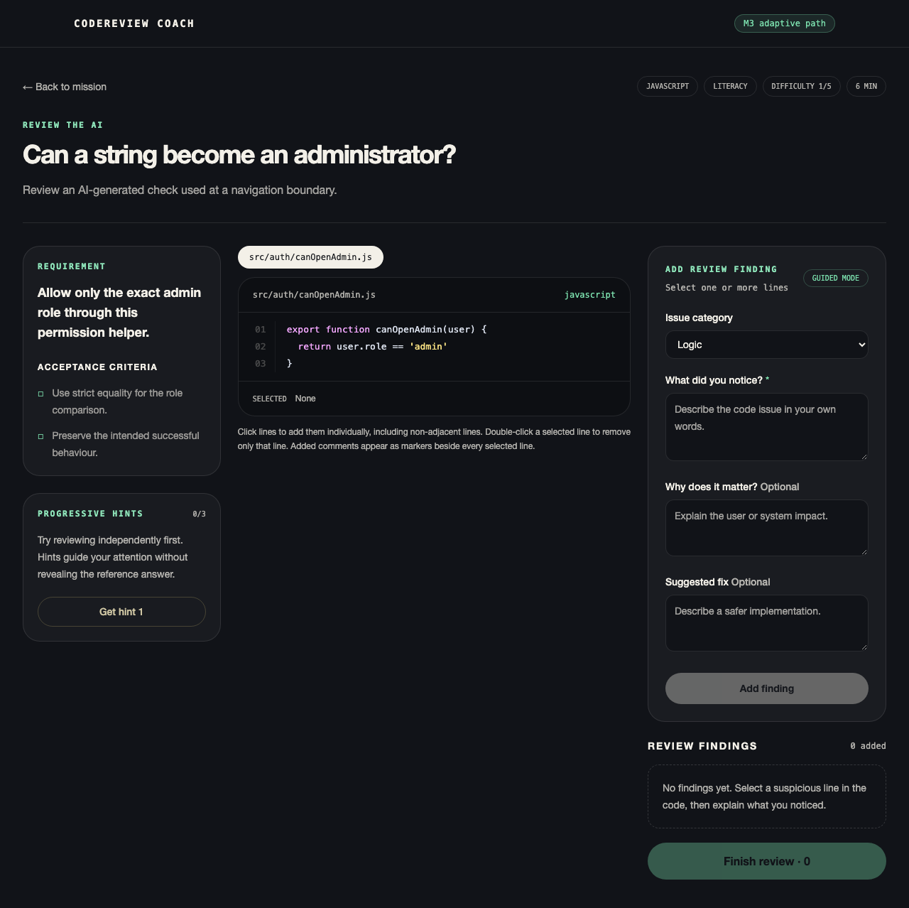

# CodeReview Coach

CodeReview Coach is a local-first learning product that helps junior developers practise reading, reviewing, explaining, and fixing code—especially code produced with AI assistance.

Version **0.1.0** is a release-ready local MVP. It includes a runtime-validated 24-exercise full-stack curriculum, versioned and portable local learner state, the complete review-feedback-fix workflow, deterministic adaptation, and an accessible progress dashboard.



## Product idea

Learners receive a short requirement and code sample, submit their own review before seeing feedback, fix the code, and then get a deterministic next-step recommendation based on completion, mastery, and weak topics.

```text
Today's Mission
→ inspect requirement and code
→ submit review findings
→ receive staged feedback
→ fix the code
→ update completion and mastery
→ recommend the next exercise
```

## Product principles

- Think first, AI second.
- Judge technical understanding separately from writing quality.
- Scaffold beginner reviews, then progressively remove guidance.
- Treat completion and mastery as different signals.
- Use one learning engine across frontend, backend, API, database, testing, and security tracks.
- Ship a useful deterministic MVP before adding AI grading or content generation.

## MVP stack

- React, TypeScript, and Vite
- Tailwind CSS
- Versioned exercise content validated with schemas
- Deterministic scoring and recommendation engines
- `localStorage` persistence behind repository interfaces
- Vitest, React Testing Library, Playwright Chromium, and axe

No backend or account is required for the initial MVP.

## Getting started

Requirements:

- Node.js 20.19 or newer
- npm 10 or newer

```bash
npm install
npm run dev
```

Quality checks:

```bash
npm run check
```

This runs formatting, ESLint, 59 unit/integration tests, TypeScript project builds, and the Vite production build. The full release gate also starts the production preview on dedicated port `4174` and runs seven Playwright browser tests:

```bash
npm run check:release
```

## Demo flow



1. Open Today’s Mission and choose a recommended review.
2. Select independent code lines with a mouse or keyboard, then describe the issue.
3. Use progressive hints only when needed and submit the review.
4. Retry from first feedback or reveal the full deterministic breakdown.
5. Fix the code, compare it with the reference, and return to the updated mission.

The submitted review is restored after refresh. A fix is required before an exercise counts as complete.

## Local data, backup, and recovery

Learner state stays in the current browser’s `localStorage`; no account or network service is required. Dashboard Data Controls can download a JSON backup, validate and restore a backup, or reset progress with confirmation. A failed import never replaces the current state. If stored data is damaged, the error page lets the learner download the original raw value before intentionally resetting the app.

Daily missions, streaks, and weekly goals use the browser’s local calendar day, including local Monday boundaries and daylight-saving transitions.

## Documentation

Start with the [documentation index](docs/README.md). The recommended reading path is:

1. [Product requirements and MVP scope](docs/01-product-requirements.md)
2. [Core UI and UX](docs/02-core-ui-ux.md)
3. [Learning, scoring, and adaptive model](docs/03-learning-scoring-adaptive-model.md)
4. [End-to-end product workflows](docs/04-product-workflows.md)
5. [System architecture](docs/05-system-architecture.md)
6. [Data model and content schema](docs/06-data-model-content-schema.md)
7. [API and service contracts](docs/07-api-service-contracts.md)
8. [AI integration roadmap](docs/08-ai-roadmap.md)
9. [Testing and quality requirements](docs/09-testing-quality-requirements.md)
10. [Delivery plan and dependency map](docs/10-delivery-plan-dependencies.md)

Supporting documents:

- [Roadmap](ROADMAP.md)
- [Repository structure](docs/repository-structure.md)
- [Decision log](docs/decisions/README.md)
- [Glossary](docs/glossary.md)
- [Contributing guide](CONTRIBUTING.md)
- [Security policy](SECURITY.md)

## Implemented learning loop

The golden React exercise now supports the complete review-feedback-fix flow:

```text
dashboard
→ challenge brief
→ select a suspicious line
→ structured finding
→ progressive hints
→ submit and persist an attempt
→ first-feedback state
→ learner-controlled final reveal
→ edit and submit a code fix
→ compare original, learner fix, and reference implementation
→ persist completion
→ calculate mastery, weak areas, streaks, goals, and unlocks
→ inspect recent activity and track/level progress
```

The same flow now runs across 24 curated exercises covering JavaScript, TypeScript, React, Python, FastAPI, REST APIs, SQL, MongoDB/Cosmos DB, testing, and security. Two multi-file Level 3 exercises validate cross-stack review and the Boss Review model.

## Project management

Planning and execution are tracked in [Linear](https://linear.app/taoyan929/project/codereview-coach-56956b929ac7). Repository documents are the implementation reference; material decisions must be reflected in the matching Linear issue or project document so the two systems do not drift.

## Release status

- Project status: M1–M3 MVP complete; TAO-26 and TAO-30 acceptance audited in Linear; TAO-24 owns the release record
- M1–M5 milestones: defined
- Application scaffold: complete
- Exercise and learner-state contracts: initial version implemented
- Curriculum: 24 curated exercises, 100-point built-in path, all 10 MVP tracks, all 3 learning levels, and all 8 mission formats
- Content quality: startup schema/QA validation plus 96 embedded golden scoring cases covering strong, poor-English-but-correct, partial, and incorrect responses
- Structured review workspace: independent line selection, guided findings, progressive hints, multiple comments, submission, retry, and local attempt persistence implemented
- Deterministic scoring: finding-level technical dimensions, separate communication score, assistance tracking, staged feedback, and final reveal implemented
- Fix practice: editable working copy, learner-gated reference comparison, structured fix submission, and completion transition implemented
- Progress tracking: separate curriculum completion and mastery, all-track/all-level breakdowns, weak areas, activity history, streaks, daily/weekly goals, unlock states, and reset implemented
- Adaptive path: explainable 1–3 item Daily Missions use prerequisites, level gates, weak concepts, recent results, hint independence, preferred tracks, difficulty, recency, and mission-format rotation
- Reliability: atomic backup/restore, raw-data recovery, browser-local calendar semantics, explicit session state machine, and central learning thresholds
- Accessibility: keyboard line removal, selected-line controls, skip link, visible focus, tab/tabpanel relationships, live status, CTA explanations, contrast checks, and axe coverage
- Browser quality: Chromium workflows, console/unhandled-error failure policy, and 390/768/1280 horizontal-overflow tests

## Known limitations

- Progress is tied to one browser profile unless a backup is exported and restored elsewhere.
- Scoring is deterministic and English-oriented; it recognises curated technical aliases but does not yet provide semantic or multilingual AI coaching.
- Exercises are curated local content. GitHub pull-request import, accounts, cloud sync, and shared progress are intentionally outside the MVP.
- In-progress form drafts are not persisted. A submitted review is recoverable after refresh; text entered before submission is not.
- The built-in code editor is designed for short practice snippets, not full repository-scale editing or code execution.

## License

No license has been selected yet. Until a license is added, all rights are reserved by the repository owner.
